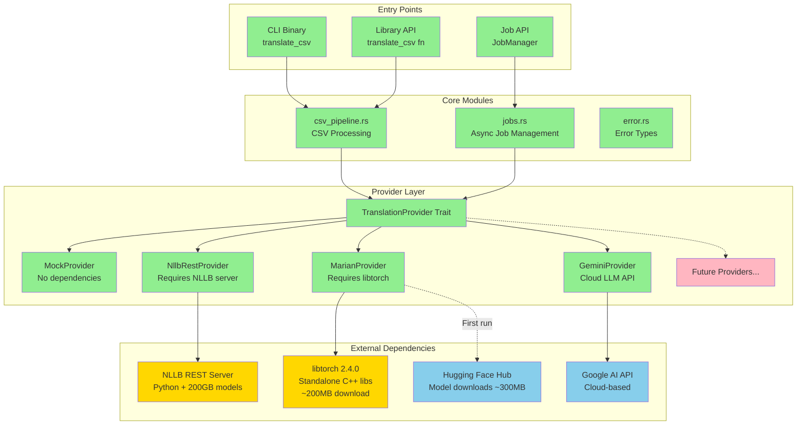
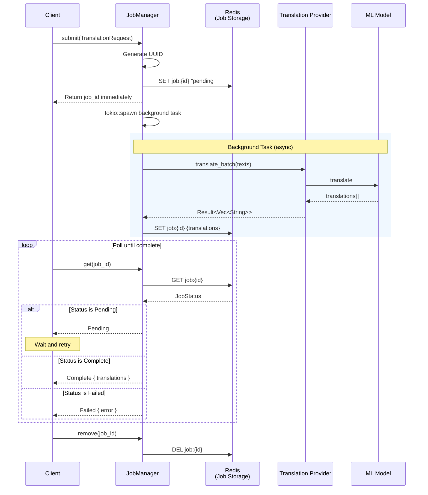
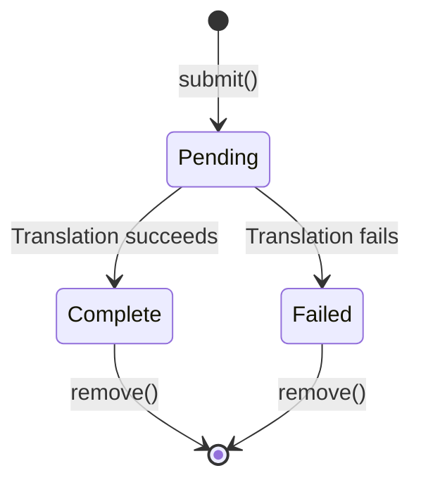
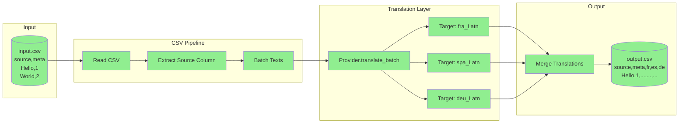
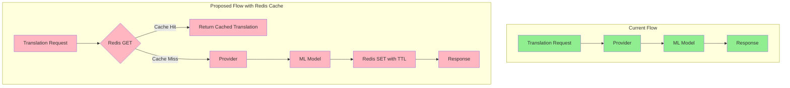
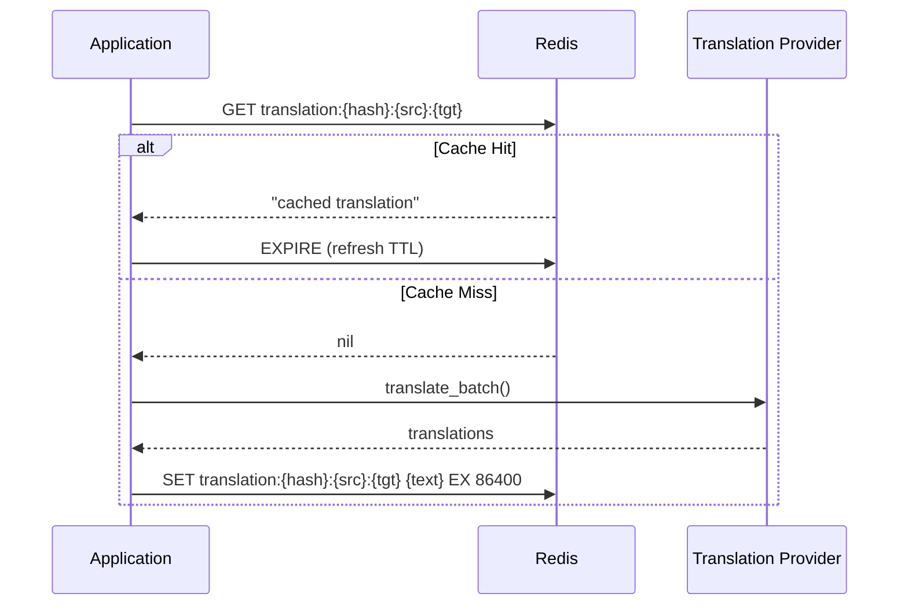
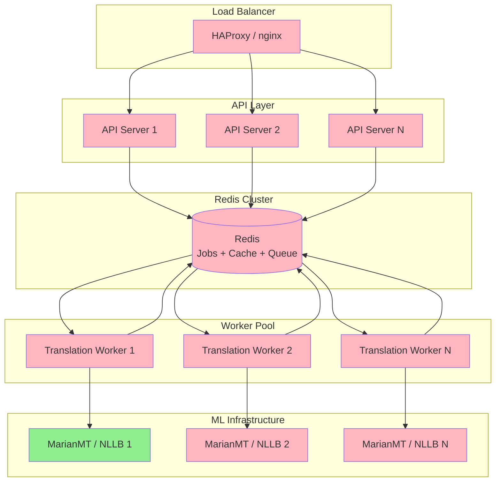
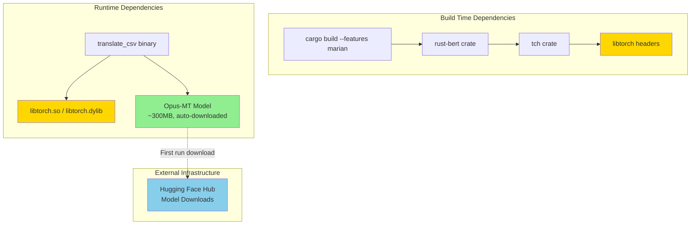
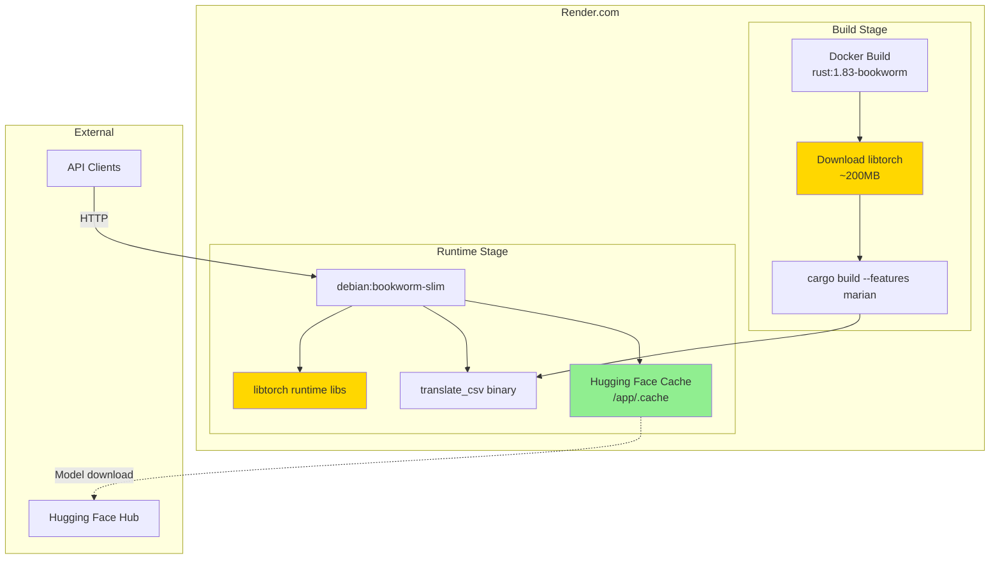

# CSV Translation Pipeline - Architecture Documentation

## Overview

The CSV Translation Pipeline is an async Rust library and CLI tool for translating CSV files into multiple languages using pluggable translation providers. It is built on Tokio for async runtime, uses a trait-based provider abstraction, and supports both batch file processing and job-based async translation for web service integration.

### Key Features

- Async/await throughout using Tokio runtime
- Pluggable translation providers via trait abstraction
- Job-based API for web service integration (submit job, poll for status)
- Retry logic with exponential backoff and jitter
- Type-safe error handling with `thiserror`

---

## Current Implementation Status

| Component | Status | Notes |
|-----------|--------|-------|
| CSV Pipeline | Complete | Reads CSV, translates, writes output |
| Mock Provider | Complete | For testing and development |
| NLLB REST Provider | Complete | With retry/backoff logic |
| MarianMT Provider | Complete | Pure Rust, requires `marian` feature |
| Gemini Provider | Complete | Cloud LLM via Google AI API |
| Job Manager | Complete | Async job submission and polling |
| CLI Tool | Complete | Full command-line interface |
| Redis Translation Cache | Not Started | See Redis Cache section |
| Redis Job Storage | Not Started | Jobs stored in-memory only |
| Distributed Workers | Not Started | Single-process only |

---

## Component Architecture



**Legend:**
- Green: Implemented (Rust code)
- Yellow: External dependency (requires installation)
- Blue: External service (auto-accessed)
- Red: Not yet implemented

---

## Job ID Flow Sequence Diagram

The Job API allows clients to submit translation requests and poll for results asynchronously. This is ideal for web frameworks like Axum where you do not want to block on long-running translations.



### Job Status State Machine



---

## Data Flow Diagram

Shows the flow of data through the CSV translation pipeline:



---

## Redis Translation Cache (NOT YET IMPLEMENTED)

> **STATUS: TODO**
>
> This section describes using Redis as a simple KV cache for translations to avoid redundant ML model calls.

### Concept

Redis acts as a cache layer between the application and the translation provider. Before calling the ML model, the system checks if an identical translation already exists in Redis.



### Redis Key Schema

Simple key-value structure using SHA-256 hashes:

```
Key:   translation:{sha256(source_text)}:{src_lang}:{tgt_lang}
Value: {translated_text}
TTL:   86400 (24 hours, configurable)

Example:
  Key:   translation:a1b2c3d4...:{eng_Latn}:{fra_Latn}
  Value: "Bonjour le monde"
```

### Redis Cache Flow



### Implementation Notes (TODO)

1. **Key format**: `translation:{sha256}:{src_lang}:{tgt_lang}` for fast O(1) lookups
2. **Batch optimization**: Use `MGET` to check all texts in batch, only send cache misses to provider
3. **TTL-based expiry**: 24-hour default TTL, refreshed on cache hit
4. **Memory management**: Redis handles eviction automatically with `maxmemory-policy allkeys-lru`

### Rust Implementation Sketch

```rust
use redis::AsyncCommands;
use sha2::{Sha256, Digest};

pub struct RedisTranslationCache {
    client: redis::Client,
    ttl_seconds: u64,
}

impl RedisTranslationCache {
    fn cache_key(text: &str, src_lang: &str, tgt_lang: &str) -> String {
        let hash = Sha256::digest(text.as_bytes());
        format!("translation:{:x}:{}:{}", hash, src_lang, tgt_lang)
    }

    pub async fn get(&self, text: &str, src: &str, tgt: &str) -> Option<String> {
        let mut conn = self.client.get_multiplexed_async_connection().await.ok()?;
        let key = Self::cache_key(text, src, tgt);
        conn.get(&key).await.ok()
    }

    pub async fn set(&self, text: &str, src: &str, tgt: &str, translation: &str) {
        if let Ok(mut conn) = self.client.get_multiplexed_async_connection().await {
            let key = Self::cache_key(text, src, tgt);
            let _: Result<(), _> = conn.set_ex(&key, translation, self.ttl_seconds).await;
        }
    }
}
```

### Dependencies

Add to `Cargo.toml`:

```toml
redis = { version = "0.25", features = ["tokio-comp", "connection-manager"] }
sha2 = "0.10"
```

---

## Scalability Architecture (Future Vision)

The current implementation runs as a single process with in-memory job storage. Here is a vision for horizontal scaling using Redis as the central data store:



**Legend:**
- Green: Available today
- Red: Future implementation

### Redis Data Structures

| Purpose | Redis Type | Key Pattern |
|---------|------------|-------------|
| Job Status | String | `job:{uuid}` |
| Job Queue | List | `queue:translations` |
| Translation Cache | String | `translation:{hash}:{src}:{tgt}` |
| Rate Limiting | Sorted Set | `ratelimit:{provider}` |

### Scaling Components

| Component | Current | Future |
|-----------|---------|--------|
| Job Storage | In-memory HashMap | Redis String |
| Job Queue | Direct tokio::spawn | Redis List (LPUSH/BRPOP) |
| Workers | Single process | Distributed worker pool |
| Translation Cache | None | Redis String with TTL |
| Load Balancing | N/A | HAProxy/nginx |
| ML Servers | Single instance | Load-balanced cluster |

---

## Module Reference

### `lib.rs`
Entry point that re-exports public API:
- `translate_csv` - Main CSV translation function
- `CsvTranslateConfig` - Configuration struct
- `TranslateError` - Error enum
- `JobManager`, `JobId`, `JobStatus` - Job API types
- `TranslationProvider` - Provider trait

### `csv_pipeline.rs`
Handles CSV file I/O and orchestrates translation:
- Reads input CSV with `csv_async`
- Extracts source column texts
- Calls provider for each target language
- Writes output CSV with new translation columns

### `jobs.rs`
Async job management for web service integration:
- `JobManager<P>` - Thread-safe job manager (Clone + Send + Sync)
- `TranslationRequest` - Job input specification
- `JobStatus` - Enum: Pending, Complete, Failed
- Background task spawning with `tokio::spawn`

### `error.rs`
Unified error handling:
```rust
pub enum TranslateError {
    Io(std::io::Error),
    Http(reqwest::Error),
    Csv(csv_async::Error),
    Provider(String),
}
```

### `provider/mod.rs`
Defines the `TranslationProvider` trait:
```rust
pub trait TranslationProvider: Send + Sync + 'static {
    fn translate_batch(
        &self,
        src_lang: &str,
        tgt_lang: &str,
        texts: &[String],
    ) -> impl Future<Output = Result<Vec<String>, TranslateError>> + Send;

    fn name(&self) -> &'static str;
}
```

### `provider/mock.rs`
Test provider that wraps input with markers:
```
Input:  "Hello"
Output: "[mock::fra_Latn] Hello"
```

### `provider/nllb_rest.rs`
Production provider with resilience features:
- Configurable timeout (default: 30s)
- Retry with exponential backoff (default: 3 retries)
- Jitter to prevent thundering herd
- Retryable status codes: 408, 429, 500, 502, 503, 504

### `provider/marian.rs` (requires `marian` feature)
Pure Rust translation using MarianMT models from rust-bert:
- No Python runtime required
- Uses pre-trained Opus-MT models from University of Helsinki
- CPU and GPU (CUDA) support via libtorch
- Automatic model download and caching (~300MB)
- Thread-safe via Mutex wrapper

---

## How to Extend with New Providers

### Step 1: Create Provider Module

Create a new file `src/provider/your_provider.rs`:

```rust
use crate::error::TranslateError;
use crate::provider::TranslationProvider;

pub struct YourProvider {
    // Your configuration fields
}

impl YourProvider {
    pub fn new(/* config */) -> Self {
        Self { /* ... */ }
    }
}

impl TranslationProvider for YourProvider {
    async fn translate_batch(
        &self,
        src_lang: &str,
        tgt_lang: &str,
        texts: &[String],
    ) -> Result<Vec<String>, TranslateError> {
        // 1. Handle empty input
        if texts.is_empty() {
            return Ok(Vec::new());
        }

        // 2. Call your translation API
        // 3. Return Vec<String> with same length as input

        todo!()
    }

    fn name(&self) -> &'static str {
        "your-provider"
    }
}
```

### Step 2: Export from Provider Module

Add to `src/provider/mod.rs`:

```rust
pub mod your_provider;
```

### Step 3: Add CLI Support (Optional)

Update `src/bin/translate_csv.rs`:

```rust
#[derive(Clone, Copy, Debug, ValueEnum)]
enum Provider {
    Mock,
    Nllb,
    YourProvider,  // Add variant
}

// In main():
Provider::YourProvider => {
    let provider = YourProvider::new(/* config from args */);
    translate_csv(&provider, &args.input, &args.output, config).await?;
}
```

### Provider Contract

Implementations MUST:
1. Return exactly `texts.len()` translations in the same order
2. Be `Send + Sync` (safe for concurrent use)
3. Handle empty input gracefully (return empty Vec)

---

## Dependencies

| Crate | Purpose |
|-------|---------|
| `tokio` | Async runtime with multi-threaded executor |
| `csv-async` | Async CSV parsing and writing |
| `reqwest` | HTTP client for REST providers |
| `serde` | Serialization for API requests/responses |
| `thiserror` | Derive macro for error types |
| `clap` | Command-line argument parsing |
| `uuid` | Job ID generation |
| `fastrand` | Fast random number generation for jitter |
| `rust-bert` | MarianMT models (optional, `marian` feature) |
| `tch` | libtorch bindings (optional, `marian` feature) |

### External Dependencies (MarianMT Only)

When using the `marian` feature, the application requires **libtorch** (standalone C++ libraries, no Python) at both compile time and runtime:



**Legend:**
- Yellow: libtorch (required for MarianMT)
- Green: Auto-managed
- Blue: External service

---

## Translation Provider Comparison

This section compares the available translation providers to help you choose the right one for your use case.

### Provider Feature Matrix

| Feature | MockProvider | NllbRestProvider | MarianProvider | GeminiProvider |
|---------|--------------|------------------|----------------|----------------|
| Production Ready | No | Yes | Yes | Yes |
| External Dependencies | None | NLLB REST Server | libtorch | API Key |
| Python Required | No | Yes (server) | No | No |
| Offline Capable | Yes | No | Yes | No |
| Languages Supported | N/A | 200+ | ~50 pairs | 100+ |
| Translation Quality | Fake | Excellent | Good | Excellent |
| First Run Setup | None | Server setup | ~300MB download | API key only |
| GPU Acceleration | N/A | Yes | Yes (CUDA) | Cloud (managed) |
| Latency | <1ms | 100-500ms | 50-200ms | 200-1000ms |
| Cost | Free | Self-hosted | Self-hosted | Pay-per-token |

### When to Use Each Provider

**MockProvider**
- Unit testing and CI pipelines
- Development without ML infrastructure
- Benchmarking pipeline overhead

**NllbRestProvider**
- Production with many language pairs (200+)
- When Python infrastructure is acceptable
- Best translation quality requirements
- Shared translation service for multiple clients

**MarianProvider**
- Pure Rust deployments (no Python runtime)
- Offline or edge deployments
- European language pairs
- Single-binary distribution

**GeminiProvider**
- Rapid deployment without ML infrastructure
- High-quality translations with LLM capabilities
- Context-aware translation (preserves tone, handles idioms)
- When API costs are acceptable
- Multi-language support without model downloads

### MarianMT Architecture

MarianMT is a neural machine translation architecture developed by the Microsoft Translator team. The rust-bert implementation uses pre-trained Opus-MT models from the University of Helsinki.

```
+-------------------+     +------------------+     +-------------------+
| Input Text        | --> | Encoder          | --> | Decoder           |
| "Hello world"     |     | (Transformer)    |     | (Transformer)     |
+-------------------+     +------------------+     +-------------------+
                                                            |
                                                            v
                                                   +-------------------+
                                                   | Output Text       |
                                                   | "Bonjour le monde"|
                                                   +-------------------+
```

**Key Characteristics:**
- Encoder-decoder Transformer architecture
- Language-pair specific models (e.g., en-fr, en-de)
- ~300MB per language pair
- Optimized for European languages
- No intermediate pivot language (direct translation)

### libtorch Installation

MarianProvider requires libtorch - **standalone C++ libraries, no Python needed**.

**macOS:**
```bash
curl -LO https://download.pytorch.org/libtorch/cpu/libtorch-macos-arm64-2.4.0.zip
unzip libtorch-macos-arm64-2.4.0.zip
export LIBTORCH=$(pwd)/libtorch
export DYLD_LIBRARY_PATH=${LIBTORCH}/lib:$DYLD_LIBRARY_PATH
```

**Linux:**
```bash
wget https://download.pytorch.org/libtorch/cpu/libtorch-cxx11-abi-shared-with-deps-2.4.0+cpu.zip
unzip libtorch-cxx11-abi-shared-with-deps-2.4.0+cpu.zip
export LIBTORCH=$(pwd)/libtorch
export LD_LIBRARY_PATH=${LIBTORCH}/lib:$LD_LIBRARY_PATH
```

### Known Issues

**macOS Compilation Error (rust-bert issue #486):**
The `rust-bert` crate has a dependency chain issue on macOS where `console` crate's `std` feature is not enabled. This project includes a workaround in `Cargo.toml` that explicitly enables the feature. If you encounter errors like `"unresolved import console::Term"`, ensure you are using the version of `Cargo.toml` from this repository.

### Gemini Provider Architecture

GeminiProvider uses Google's Gemini LLM for translation via the Google AI API. Unlike traditional NMT models, Gemini provides context-aware translation with understanding of idioms, tone, and nuance.

```
+-------------------+     +------------------+     +-------------------+
| Input Text        | --> | Gemini API       | --> | Output Text       |
| "Hello world"     |     | (Cloud LLM)      |     | "Bonjour le monde"|
+-------------------+     +------------------+     +-------------------+
                                |
                                v
                    +------------------------+
                    | Structured Prompt      |
                    | - Source language      |
                    | - Target language      |
                    | - Translation context  |
                    +------------------------+
```

**Key Characteristics:**
- Cloud-based LLM (no local model)
- API key authentication required
- Supports 100+ languages
- Context-aware translations
- Pay-per-token pricing
- Rate limiting considerations

### Gemini Provider Setup

**Step 1: Get API Key**
1. Go to [Google AI Studio](https://aistudio.google.com/)
2. Create or select a project
3. Generate an API key
4. Store securely (never commit to git)

**Step 2: Set Environment Variable**
```bash
export GEMINI_API_KEY="your-api-key-here"
```

**Step 3: Enable Feature and Use**
```bash
cargo build --features gemini
cargo run --features gemini -- --provider gemini --input data.csv --output out.csv
```

### Gemini Provider Implementation Sketch

```rust
//! Gemini translation provider using Google AI API.
//!
//! # Requirements
//!
//! - `GEMINI_API_KEY` environment variable must be set
//! - Network access to `generativelanguage.googleapis.com`
//!
//! # Rate Limiting
//!
//! Gemini API has rate limits. The provider implements:
//! - Exponential backoff on 429 responses
//! - Configurable requests-per-minute limit
//! - Automatic batch splitting for large requests

use crate::error::TranslateError;
use crate::provider::TranslationProvider;
use reqwest::Client;
use serde::{Deserialize, Serialize};
use std::time::Duration;
use tokio::time::sleep;

/// Default configuration for the Gemini provider.
mod defaults {
    use std::time::Duration;

    /// Default request timeout.
    pub const TIMEOUT: Duration = Duration::from_secs(60);

    /// Default maximum retry attempts.
    pub const MAX_RETRIES: u32 = 3;

    /// Maximum texts per batch (to stay within token limits).
    pub const MAX_BATCH_SIZE: usize = 50;

    /// Requests per minute limit.
    pub const RATE_LIMIT_RPM: u32 = 60;
}

/// Gemini API translation provider.
///
/// Uses Google's Gemini LLM for high-quality, context-aware translations.
///
/// # Example
///
/// ```no_run
/// use translator::provider::gemini::GeminiProvider;
/// use translator::TranslationProvider;
///
/// # async fn example() -> Result<(), translator::TranslateError> {
/// let provider = GeminiProvider::from_env()?;
///
/// let translations = provider
///     .translate_batch("eng_Latn", "fra_Latn", &["Hello".to_string()])
///     .await?;
/// # Ok(())
/// # }
/// ```
#[derive(Clone)]
pub struct GeminiProvider {
    client: Client,
    api_key: String,
    model: String,
    timeout: Duration,
    max_retries: u32,
    max_batch_size: usize,
}

impl GeminiProvider {
    /// Create provider from environment variable `GEMINI_API_KEY`.
    pub fn from_env() -> Result<Self, TranslateError> {
        let api_key = std::env::var("GEMINI_API_KEY")
            .map_err(|_| TranslateError::Provider(
                "GEMINI_API_KEY environment variable not set".into()
            ))?;

        Ok(Self {
            client: Client::new(),
            api_key,
            model: "gemini-1.5-flash".into(),
            timeout: defaults::TIMEOUT,
            max_retries: defaults::MAX_RETRIES,
            max_batch_size: defaults::MAX_BATCH_SIZE,
        })
    }

    /// Create provider with explicit API key.
    pub fn new(api_key: impl Into<String>) -> Self {
        Self {
            client: Client::new(),
            api_key: api_key.into(),
            model: "gemini-1.5-flash".into(),
            timeout: defaults::TIMEOUT,
            max_retries: defaults::MAX_RETRIES,
            max_batch_size: defaults::MAX_BATCH_SIZE,
        }
    }

    /// Set the Gemini model to use.
    ///
    /// Available models:
    /// - `gemini-1.5-flash` (default, fast and efficient)
    /// - `gemini-1.5-pro` (more capable, slower)
    pub fn with_model(mut self, model: impl Into<String>) -> Self {
        self.model = model.into();
        self
    }

    /// Set the request timeout.
    pub fn with_timeout(mut self, timeout: Duration) -> Self {
        self.timeout = timeout;
        self
    }

    /// Build the translation prompt for Gemini.
    fn build_prompt(&self, src_lang: &str, tgt_lang: &str, texts: &[String]) -> String {
        let texts_json = serde_json::to_string(texts).unwrap_or_default();
        format!(
            r#"Translate the following texts from {src_lang} to {tgt_lang}.
Return ONLY a JSON array of translated strings in the same order.
Do not include any explanation or markdown formatting.

Input texts: {texts_json}

Output:"#
        )
    }
}

/// Gemini API request body.
#[derive(Serialize)]
struct GeminiRequest {
    contents: Vec<Content>,
    generation_config: GenerationConfig,
}

#[derive(Serialize)]
struct Content {
    parts: Vec<Part>,
}

#[derive(Serialize)]
struct Part {
    text: String,
}

#[derive(Serialize)]
struct GenerationConfig {
    temperature: f32,
    max_output_tokens: u32,
}

/// Gemini API response.
#[derive(Deserialize)]
struct GeminiResponse {
    candidates: Vec<Candidate>,
}

#[derive(Deserialize)]
struct Candidate {
    content: CandidateContent,
}

#[derive(Deserialize)]
struct CandidateContent {
    parts: Vec<ResponsePart>,
}

#[derive(Deserialize)]
struct ResponsePart {
    text: String,
}

impl TranslationProvider for GeminiProvider {
    async fn translate_batch(
        &self,
        src_lang: &str,
        tgt_lang: &str,
        texts: &[String],
    ) -> Result<Vec<String>, TranslateError> {
        if texts.is_empty() {
            return Ok(Vec::new());
        }

        // Split into smaller batches if needed
        if texts.len() > self.max_batch_size {
            let mut all_translations = Vec::with_capacity(texts.len());
            for chunk in texts.chunks(self.max_batch_size) {
                let chunk_translations = self
                    .translate_batch(src_lang, tgt_lang, chunk)
                    .await?;
                all_translations.extend(chunk_translations);
            }
            return Ok(all_translations);
        }

        let url = format!(
            "https://generativelanguage.googleapis.com/v1beta/models/{}:generateContent?key={}",
            self.model, self.api_key
        );

        let prompt = self.build_prompt(src_lang, tgt_lang, texts);

        let request_body = GeminiRequest {
            contents: vec![Content {
                parts: vec![Part { text: prompt }],
            }],
            generation_config: GenerationConfig {
                temperature: 0.1, // Low temperature for consistent translations
                max_output_tokens: 8192,
            },
        };

        let mut last_error = String::new();

        for attempt in 0..=self.max_retries {
            let result = self
                .client
                .post(&url)
                .timeout(self.timeout)
                .json(&request_body)
                .send()
                .await;

            match result {
                Ok(response) => {
                    let status = response.status();

                    if status.is_success() {
                        let gemini_response: GeminiResponse = response.json().await?;

                        // Extract the text from the response
                        let response_text = gemini_response
                            .candidates
                            .first()
                            .and_then(|c| c.content.parts.first())
                            .map(|p| p.text.clone())
                            .ok_or_else(|| {
                                TranslateError::Provider("Empty response from Gemini".into())
                            })?;

                        // Parse the JSON array of translations
                        let translations: Vec<String> = serde_json::from_str(&response_text)
                            .map_err(|e| {
                                TranslateError::Provider(format!(
                                    "Failed to parse Gemini response: {e}"
                                ))
                            })?;

                        // Validate response length
                        if translations.len() != texts.len() {
                            return Err(TranslateError::count_mismatch(
                                texts.len(),
                                translations.len(),
                            ));
                        }

                        return Ok(translations);
                    }

                    // Handle rate limiting
                    if status.as_u16() == 429 && attempt < self.max_retries {
                        let backoff = Duration::from_secs(2u64.pow(attempt));
                        eprintln!(
                            "[gemini] Rate limited, retrying in {:?}",
                            backoff
                        );
                        sleep(backoff).await;
                        last_error = "Rate limited (429)".into();
                        continue;
                    }

                    let body = response.text().await.unwrap_or_default();
                    return Err(TranslateError::Provider(format!(
                        "Gemini API error {status}: {body}"
                    )));
                }
                Err(err) => {
                    if err.is_timeout() && attempt < self.max_retries {
                        let backoff = Duration::from_secs(2u64.pow(attempt));
                        sleep(backoff).await;
                        last_error = err.to_string();
                        continue;
                    }
                    return Err(err.into());
                }
            }
        }

        Err(TranslateError::retries_exhausted(self.max_retries, last_error))
    }

    fn name(&self) -> &'static str {
        "gemini"
    }
}
```

### Gemini Rate Limiting Considerations

The Gemini API has rate limits that vary by model and account tier:

| Tier | Requests/Minute | Tokens/Minute |
|------|-----------------|---------------|
| Free | 15 | 1,000,000 |
| Pay-as-you-go | 60+ | 4,000,000+ |

**Best Practices:**
1. Use batch translations to reduce request count
2. Implement exponential backoff on 429 responses
3. Consider caching translations in Redis
4. Monitor usage via Google Cloud Console

---

## Future Work

### High Priority

1. **Redis Translation Cache** - Cache translations in Redis to reduce ML model calls
2. **Redis Job Storage** - Replace in-memory HashMap with Redis for job persistence
3. **Batch Optimization** - Split large batches for better throughput

### Medium Priority

4. **Metrics/Observability** - Add tracing, Prometheus metrics
5. **Rate Limiting** - Protect downstream ML services
6. **Provider Selection UI** - Allow users to select provider in web interface

### Lower Priority

7. **Distributed Workers** - Message queue based job processing
8. **Admin API** - Job listing, cancellation, priority
9. **Streaming Results** - Return translations as they complete

---

## Quick Reference

### CLI Usage

```bash
# Mock provider (testing)
translate_csv --input data.csv --output out.csv

# NLLB provider (requires NLLB server)
translate_csv --provider nllb --nllb-url http://localhost:8080 \
    --input data.csv --output out.csv \
    --target fr=fra_Latn --target es=spa_Latn

# MarianMT provider (requires libtorch, build with --features marian)
translate_csv --provider marian --input data.csv --output out.csv \
    --target fr=fra_Latn

# Gemini provider (requires GEMINI_API_KEY env var, build with --features gemini)
export GEMINI_API_KEY="your-api-key"
translate_csv --provider gemini --input data.csv --output out.csv \
    --target fr=fra_Latn --target es=spa_Latn

# Custom source column and language
translate_csv --source-col text --src-lang eng_Latn \
    --target de=deu_Latn --input data.csv --output out.csv
```

### Library Usage

```rust
use translator::{translate_csv, CsvTranslateConfig, provider::nllb_rest::NllbRestProvider};

let provider = NllbRestProvider::new("http://localhost:8080");
let config = CsvTranslateConfig {
    source_col: "text".into(),
    src_lang: "eng_Latn".into(),
    targets: vec![("fr".into(), "fra_Latn".into())],
};

translate_csv(&provider, "input.csv", "output.csv", config).await?;
```

### Job API Usage

```rust
use translator::{JobManager, TranslationRequest, JobStatus};
use translator::provider::nllb_rest::NllbRestProvider;

let manager = JobManager::new(NllbRestProvider::new("http://localhost:8080"));

// Submit job (returns immediately)
let job_id = manager.submit(TranslationRequest {
    texts: vec!["Hello".into(), "World".into()],
    src_lang: "eng_Latn".into(),
    targets: vec![("fr".into(), "fra_Latn".into())],
});

// Poll for status
loop {
    match manager.get(&job_id) {
        Some(JobStatus::Pending) => tokio::time::sleep(Duration::from_millis(100)).await,
        Some(JobStatus::Complete { translations }) => {
            println!("Done: {:?}", translations);
            break;
        }
        Some(JobStatus::Failed { error }) => panic!("Failed: {}", error),
        None => panic!("Job not found"),
    }
}
```

---

## Deployment

### Local Development Setup

#### macOS

```bash
# 1. Download libtorch directly (standalone C++ library, NO Python needed)
curl -LO https://download.pytorch.org/libtorch/cpu/libtorch-macos-arm64-2.4.0.zip
unzip libtorch-macos-arm64-2.4.0.zip

# 2. Set environment variables (add to ~/.zshrc)
export LIBTORCH=$(pwd)/libtorch
export DYLD_LIBRARY_PATH=${LIBTORCH}/lib:$DYLD_LIBRARY_PATH

# 3. Verify installation
ls $LIBTORCH/lib/libtorch*.dylib

# 4. Build with MarianMT support
cargo build --features marian

# 5. Run tests (downloads ~300MB model on first run)
cargo test --features marian marian -- --ignored --nocapture
```

#### Linux

```bash
# 1. Download libtorch (standalone C++ library, NO Python needed)
wget https://download.pytorch.org/libtorch/cpu/libtorch-cxx11-abi-shared-with-deps-2.4.0%2Bcpu.zip
unzip libtorch-cxx11-abi-shared-with-deps-2.4.0+cpu.zip

# 2. Set environment variables (add to ~/.bashrc)
export LIBTORCH=$(pwd)/libtorch
export LD_LIBRARY_PATH=${LIBTORCH}/lib:$LD_LIBRARY_PATH

# 3. Build
cargo build --features marian
```

#### Without MarianMT (Mock/NLLB only)

If you don't need pure Rust translation, skip libtorch entirely:

```bash
# Build without MarianMT - no external dependencies
cargo build --release

# Use with MockProvider (testing) or NllbRestProvider (production)
./target/release/translate_csv --provider mock --input data.csv --output out.csv
```

---

### Render.com Deployment (Free Tier)

Render.com offers free hosting for Docker-based web services. The following configuration deploys the translation pipeline with MarianMT support.

#### Deployment Architecture



#### Dockerfile

Create `Dockerfile` in the project root:

```dockerfile
# Build stage - compile with libtorch
FROM rust:1.83-bookworm AS builder

WORKDIR /app

# Install build dependencies
RUN apt-get update && apt-get install -y \
    wget \
    unzip \
    && rm -rf /var/lib/apt/lists/*

# Download libtorch (standalone C++ libs, no Python needed)
RUN wget -q https://download.pytorch.org/libtorch/cpu/libtorch-cxx11-abi-shared-with-deps-2.4.0%2Bcpu.zip \
    && unzip -q libtorch-cxx11-abi-shared-with-deps-2.4.0+cpu.zip -d /opt \
    && rm libtorch-cxx11-abi-shared-with-deps-2.4.0+cpu.zip

ENV LIBTORCH=/opt/libtorch
ENV LD_LIBRARY_PATH=${LIBTORCH}/lib:${LD_LIBRARY_PATH}

# Copy manifests
COPY Cargo.toml Cargo.lock ./

# Create dummy src to cache dependencies
RUN mkdir src && echo "fn main() {}" > src/main.rs
RUN cargo build --release --features marian || true
RUN rm -rf src

# Copy actual source code
COPY src ./src
COPY tests ./tests

# Build the real binary
RUN cargo build --release --features marian

# Runtime stage - minimal image with libtorch runtime
FROM debian:bookworm-slim

WORKDIR /app

# Install runtime dependencies
RUN apt-get update && apt-get install -y \
    ca-certificates \
    libgomp1 \
    && rm -rf /var/lib/apt/lists/*

# Copy libtorch runtime libraries
COPY --from=builder /opt/libtorch/lib/*.so* /usr/local/lib/
RUN ldconfig

# Copy the binary
COPY --from=builder /app/target/release/translate_csv /usr/local/bin/

# Create cache directory for Hugging Face models
RUN mkdir -p /app/.cache
ENV HF_HOME=/app/.cache

# Create non-root user
RUN useradd -m -u 1000 translator
RUN chown -R translator:translator /app
USER translator

EXPOSE 8080

# Default command - override with your Axum server binary when ready
CMD ["translate_csv", "--help"]
```

#### render.yaml

Create `render.yaml` in the project root for infrastructure-as-code deployment:

```yaml
services:
  - type: web
    name: csv-translation-pipeline
    runtime: docker
    plan: free  # Use 'starter' for more resources
    dockerfilePath: ./Dockerfile
    healthCheckPath: /health
    envVars:
      - key: HF_HOME
        value: /app/.cache
      - key: RUST_LOG
        value: info
```

#### Render Deployment Steps

**Option 1: Via Dashboard (Recommended for first deploy)**

1. Push your code to GitHub
2. Go to [dashboard.render.com](https://dashboard.render.com)
3. Click "New" → "Web Service"
4. Connect your GitHub repository
5. Render auto-detects the Dockerfile
6. Select "Free" plan
7. Click "Create Web Service"

**Option 2: Via render.yaml (Infrastructure as Code)**

1. Add `render.yaml` to your repository root
2. Go to [dashboard.render.com](https://dashboard.render.com)
3. Click "New" → "Blueprint"
4. Connect your repository
5. Render reads `render.yaml` and creates services

#### First Deployment Notes

- **Build time**: ~15-20 minutes (libtorch download + Rust compilation)
- **Image size**: ~2GB (libtorch libraries are large)
- **First request**: ~60-90 seconds (model download from Hugging Face)
- **Subsequent requests**: <500ms
- **Free tier limits**: 750 hours/month, spins down after 15 min inactivity

#### Cost Optimization

For lower resource usage, consider deploying without MarianMT:

```dockerfile
# Lightweight Dockerfile for Mock/NLLB providers only
FROM rust:1.83-slim-bookworm AS builder
WORKDIR /app
COPY . .
RUN cargo build --release

FROM debian:bookworm-slim
RUN apt-get update && apt-get install -y ca-certificates && rm -rf /var/lib/apt/lists/*
COPY --from=builder /app/target/release/translate_csv /usr/local/bin/
CMD ["translate_csv", "--help"]
```

This produces a ~50MB image vs ~2GB with MarianMT, and deploys much faster.
